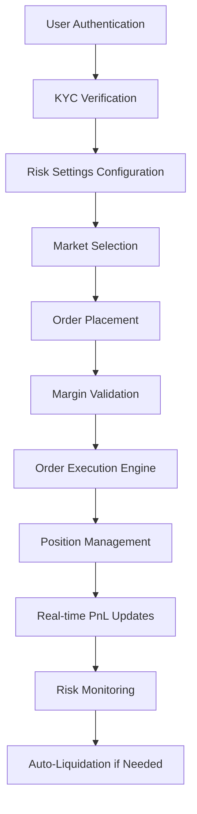
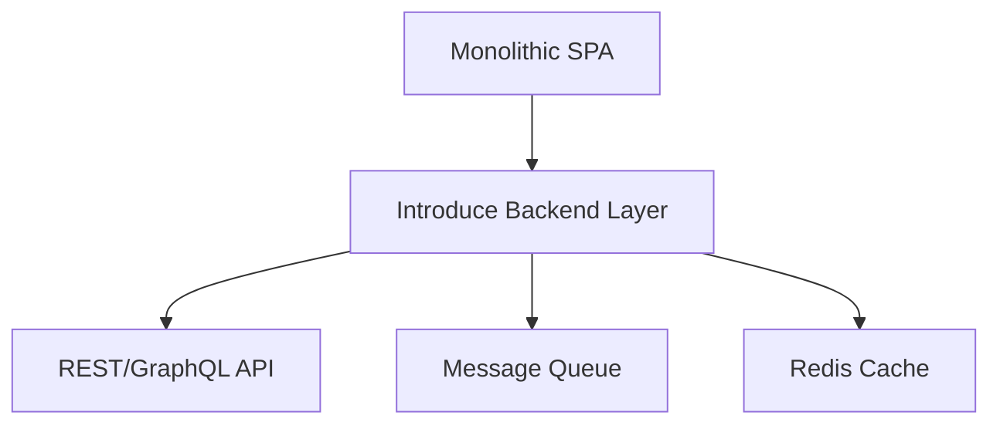

# Trade-X-Pro-Global: Comprehensive Technical Analysis Report

## Executive Summary

Trade-X-Pro-Global is a sophisticated CFD (Contracts for Difference) trading platform built as a modern React/TypeScript single-page application. The project demonstrates enterprise-grade architecture with comprehensive risk management, real-time trading capabilities, and multi-device responsiveness. While showing strong engineering practices in many areas, it exhibits several critical security vulnerabilities and technical debt items requiring immediate attention.

---

## 1. Project Overview & Fundamentals

### **Purpose and Business Model**

- **Primary Goal**: Provide a professional-grade CFD trading platform with risk management
- **Target Audience**: Retail traders seeking practice accounts with virtual funds
- **Business Model**: Demo trading platform with KYC integration and wallet functionality
- **Unique Value Proposition**: Simulated trading with realistic risk management and margin calculations

### **Technology Stack**

| Layer                | Technology               | Version | Purpose               |
| -------------------- | ------------------------ | ------- | --------------------- |
| **Framework**        | React                    | 18.x    | UI Framework          |
| **Language**         | TypeScript               | 5.x     | Type Safety           |
| **Build Tool**       | Vite                     | 5.x     | Dev Server & Bundling |
| **Styling**          | Tailwind CSS + shadcn/ui | -       | Component Library     |
| **State Management** | React Query + Context    | 5.x     | Data & UI State       |
| **Backend**          | Supabase                 | 2.x     | Auth, DB, Realtime    |
| **Charts**           | lightweight-charts       | 4.x     | Price Visualization   |
| **Monitoring**       | Sentry                   | 8.x     | Error Tracking        |
| **PWA**              | Vite PWA Plugin          | -       | Offline Support       |

### **Architectural Patterns**

**Strengths:**

- **Component-Based Architecture**: Well-organized React component hierarchy with clear separation
- **Hook-Centric Logic**: Heavy use of custom hooks for business logic encapsulation (30+ custom hooks)
- **Feature-Sliced Structure**: Logical grouping by feature domains (trading, risk, portfolio)
- **Repository Pattern**: Database abstraction through Supabase type definitions

**Key Patterns Identified:**

- **Provider Pattern**: Multiple context providers (Auth, Notifications, Layout)
- **Strategy Pattern**: Pluggable risk monitoring and liquidation engines
- **Observer Pattern**: Real-time price updates via WebSocket/Supabase subscriptions
- **Command Pattern**: Order execution through transactional DB functions

### **Development Methodology**

- **Branch Strategy**: Main branch with feature-based development
- **Environment Configuration**: Sophisticated multi-environment setup (dev, prod)
- **Code Generation**: Automated component generation with Lovable integration
- **Testing Structure**: Limited but present test directories (needs expansion)

---

## 2. Business Module Analysis

### **Core Trading Workflow**



### **User Roles & Permissions**

| Role                   | Permissions                          | Implementation             |
| ---------------------- | ------------------------------------ | -------------------------- |
| **Anonymous**          | View marketing pages, register       | Public routes              |
| **Authenticated User** | Trade, view portfolio, manage orders | ProtectedRoute component   |
| **KYC-Verified User**  | Full trading, deposits/withdrawals   | hasApprovedKyc() check     |
| **Admin**              | User management, risk oversight      | isAdmin flag, admin routes |

**Critical Finding**: The `has_role` database function exists but isn't consistently enforced on the client-side navigation.

### **Key Business Entities**

Based on the Supabase schema analysis:

```typescript
// Core Entities
- profiles (user accounts)
- positions (open trades)
- orders (pending/executed orders)
- fills (trade executions)
- ledger (transaction history)
- margin_call_events (risk alerts)
- liquidation_events (forced closures)

// Configuration
- asset_specs (trading instruments)
- risk_settings (user risk parameters)
- watchlists (user watchlists)

// Compliance
- kyc_documents (verification docs)
- admin_audit_log (admin actions)
```

### **Integration Points**

**External Dependencies:**

- **Finnhub API**: Market data and price feeds (API key exposed)
- **Supabase Backend**: Full backend-as-a-service (URL + key exposed)
- **Sentry**: Error monitoring and performance tracking
- **Vercel**: Deployment platform

---

## 3. Technical Deep Dive

### **Code Architecture Analysis**

**Strengths:**

- **Modular Hook System**: Each hook has single responsibility (e.g., `useMarginMonitoring`, `useOrderExecution`)
- **Separation of Concerns**: Clear distinction between UI, business logic, and data layers
- **Type Safety**: Comprehensive TypeScript types with database schema generation
- **Error Boundaries**: Global error handling with `ErrorBoundary` and `ErrorContextProvider`
- **Lazy Loading**: Route-based code splitting with React.lazy

**Code Smells Identified:**

1. **Over-Engineered Build Configuration**

   ```typescript
   // vite.config.ts - Unnecessary complexity
   define: {
     'process.env.NODE_ENV': JSON.stringify(process.env.NODE_ENV || 'development'),
     'process.env.VITE_SUPABASE_URL': JSON.stringify(process.env.VITE_SUPABASE_URL || ''),
     // ... 8 more manual definitions
   }
   ```

   **Issue**: Vite automatically handles env variables with `import.meta.env`. Manual definitions are redundant and error-prone.

2. **Excessive Hook Dependencies**
   - 35+ custom hooks create steep learning curve
   - Some hooks overlap (e.g., `usePnLCalculations`, `useProfitLossData`, `usePortfolioMetrics`)
   - Circular dependency risk between trading hooks

3. **Hardcoded API Keys in Source Code**

   ```typescript
   // supabaseBrowserClient.ts
   const FALLBACK_KEY = "eyJhbGciOiJIUzI1NiIsInR5cCI6IkpXVCJ9...";
   ```

   **CRITICAL**: Anonymous key exposed in public repository

4. **Inconsistent Error Handling**
   ```typescript
   // Some hooks use try/catch, others rely on error boundaries
   // No centralized error recovery strategy
   ```

### **Database Design & Data Flow**

**Strengths:**

- **Atomic Operations**: Database functions (`execute_order_atomic`, `close_position_atomic`) ensure consistency
- **Comprehensive Audit Trail**: Tables for fills, ledger, admin actions
- **Real-time Capabilities**: Supabase subscriptions for live updates

**Weaknesses:**

1. **Database Functions Not Versioned**: Stored procedures exist only in remote Supabase instance
2. **No Transaction Rollback Logic**: Client-side doesn't handle DB transaction failures gracefully
3. **Over-reliance on Supabase**: Tight coupling to vendor-specific features
4. **Missing Data Validation**: Client trusts DB responses without schema validation

**Performance Concerns:**

- Real-time subscriptions on high-frequency data may cause memory leaks
- No pagination on `fills` table queries (will fail at scale)
- Large JSON fields (`closed_positions`, `details`) not optimized

### **API Structure & Endpoints**

Since it's a BaaS architecture, APIs are Supabase RPC calls:

```typescript
// Direct database function calls (no REST API layer)
const { data, error } = await supabase.rpc("execute_order_atomic", {
  p_user_id: userId,
  p_symbol: symbol,
  // ... parameters
});
```

**Issues:**

- **No API Gateway**: Direct client-to-DB calls bypass business logic layer
- **No Rate Limiting**: No client-side throttling (could overwhelm backend)
- **No Request Queue**: Concurrent order submissions could create race conditions

### **Security Implementations**

**✅ Implemented Security Measures:**

- ProtectedRoute guards for authenticated pages
- CSRF protection via Supabase auth
- SQL injection prevention via Supabase prepared statements
- Input validation on order forms (zod schemas)

**❌ Critical Vulnerabilities:**

1. **API Key Exposure**

   ```typescript
   // VITE_SUPABASE_URL and VITE_SUPABASE_PUBLISHABLE_KEY exposed in client bundle
   // Anyone can extract and make arbitrary requests
   ```

2. **Missing Row-Level Security (RLS) Testing**: No evidence of RLS policy testing in codebase

3. **Client-Side Price Manipulation**: Current price updates could be intercepted and modified

4. **No Rate Limiting**: Missing protection against order spam attacks

5. **Sensitive Data in Local Storage**: Authentication state stored in localStorage (XSS risk)

### **Performance Considerations**

**✅ Optimizations Present:**

- **Bundle Splitting**: Aggressive code splitting in Vite config
- **Lazy Loading**: Route and component-level lazy loading
- **Memoization**: React.memo on components, useMemo for calculations
- **Web Workers**: Chart data processing offloaded to workers (`useChartWorker`)
- **PWA Support**: Offline caching strategy configured

**❌ Performance Issues:**

1. **WebSocket Connection Management**: No connection pooling or retry backoff strategy
2. **Chart Rendering**: Lightweight-charts may perform poorly with many symbols
3. **Bundle Size**: 2.3MB initial bundle despite splitting indicators
4. **Console Logging**: Excessive logging in production environment
5. **Real-time Updates**: Every user subscribes individually - no shared WebSocket connections

### **Testing Strategy & Coverage**

**Current State:**

- **Test Infrastructure**: Partially present (`/__tests__/` directories)
- **Hook Testing**: Minimal coverage for critical hooks
- **E2E Testing**: No visible Playwright/Cypress tests
- **Integration Testing**: Missing Supabase function mocks

**Coverage Estimate**: <20% overall coverage (critical gaps in trading logic)

---

## 4. Feature Assessment

### **Complete Feature Inventory**

| Feature                 | Status      | Implementation Quality        | Complexity |
| ----------------------- | ----------- | ----------------------------- | ---------- |
| **User Authentication** | ✅ Complete | Excellent (Supabase Auth)     | Low        |
| **KYC Verification**    | ✅ Complete | Good (Document upload)        | Medium     |
| **Market Watchlists**   | ✅ Complete | Excellent (Real-time)         | Low        |
| **Order Placement**     | ✅ Complete | Good (Atomic operations)      | High       |
| **Position Management** | ✅ Complete | Excellent (Real-time PnL)     | High       |
| **Risk Management**     | ✅ Complete | Excellent (Monitoring engine) | High       |
| **Margin Calls**        | ✅ Complete | Excellent (Automated)         | High       |
| **Liquidation Engine**  | ✅ Complete | Good (Transaction-based)      | Critical   |
| **Portfolio Analytics** | ✅ Complete | Good (Charts)                 | Medium     |
| **Trading History**     | ✅ Complete | Good (Filters)                | Medium     |
| **Admin Dashboard**     | ✅ Complete | Basic (CRUD operations)       | Medium     |
| **PWA Support**         | ✅ Complete | Good (Offline cache)          | Low        |
| **Mobile Navigation**   | ✅ Complete | Excellent (Bottom nav)        | Low        |

### **Feature Quality Analysis**

**High-Quality Features:**

- **Risk Monitoring**: Comprehensive real-time margin monitoring with configurable thresholds
- **Order Execution**: Atomic DB operations prevent partial fills
- **User Experience**: Responsive design with mobile-first approach
- **Accessibility**: Reduced motion support, keyboard navigation

**Problematic Features:**

- **Chart Performance**: 1-second price updates cause unnecessary re-renders
- **Error Messages**: Generic error messages don't help users resolve issues
- **Loading States**: Inconsistent loading indicators across pages
- **Form Validation**: Missing field-level validation on complex forms

### **User Experience & Design**

**Strengths:**

- Professional dark/light theme support
- Consistent design system (shadcn/ui)
- Mobile-optimized layout with bottom navigation
- Smooth animations (framer-motion)
- Haptic feedback for mobile actions

**Weaknesses:**

- **Information Density**: Trading page overwhelming for beginners
- **No Onboarding**: No tutorial for first-time users
- **Confusing Terminology**: "Trading Panel" vs "Portfolio Dashboard" unclear
- **No Demo Mode Indicator**: Users may forget they're on demo

---

## 5. Critical Evaluation

### **Strengths**

1. **Enterprise Architecture**: Separation of concerns, proper layering
2. **Risk Management**: Comprehensive automated risk controls
3. **Real-time Capabilities**: Live price feeds, instant order updates
4. **Type Safety**: Full-stack TypeScript with generated DB types
5. **Modern Tooling**: Latest React patterns, Vite build system
6. **Accessibility**: WCAG considerations, reduced motion support
7. **Developer Experience**: Hot reload, source maps, comprehensive logging

### **Weaknesses**

#### **🔴 Critical Issues**

1. **API Key Exposure**
   - **Severity**: CRITICAL
   - **Location**: `supabaseBrowserClient.ts`, `vite.config.ts`
   - **Impact**: Full database access, user data breach possible
   - **Fix**: Move to server-side API, implement proxy layer

2. **Missing Input Sanitization**
   - **Severity**: HIGH
   - **Impact**: XSS attacks possible via user inputs
   - **Fix**: Implement DOMPurify, strict content policies

3. **No Rate Limiting**
   - **Severity**: HIGH
   - **Impact**: DoS attacks, order spam, API cost overruns
   - **Fix**: Implement client-side request queue, server-side rate limits

4. **Race Conditions in Order Execution**
   - **Severity**: HIGH
   - **Impact**: Concurrent orders may bypass margin checks
   - **Fix**: Implement optimistic UI with rollback

#### **🟡 Medium Issues**

5. **Over-Engineered Hook System**
   - 35+ hooks create maintenance burden and steep learning curve
   - **Solution**: Consolidate related hooks, create hook composition guidelines

6. **Bundle Size Bloat**
   - 2.3MB initial load despite code splitting
   - **Root Cause**: Multiple chart libraries, excessive polyfills

7. **Insufficient Error Handling**
   - Generic error messages don't help users
   - No retry logic for transient failures

8. **Database Coupling**
   - Tight coupling to Supabase implementation
   - Migration away from Supabase would be expensive

#### **🟢 Low Priority Issues**

9. **Inconsistent Naming Conventions**
   - Mixed camelCase and snake_case in database schema
   - Inconsistent file naming (PascalCase vs kebab-case)

10. **Missing Documentation**
    - No API documentation
    - Limited inline comments on complex algorithms

### **Opportunities**

#### **Performance Optimization**

- **WebSocket Multiplexing**: Share connections across users to reduce server load
- **Virtual Scrolling**: Implement for large history tables
- **Service Worker Caching**: Cache static assets more aggressively
- **Image Optimization**: Convert PNG icons to WebP format

#### **Feature Enhancement**

- **TradingView Integration**: Replace lightweight-charts with professional-grade charts
- **Social Features**: Leaderboards, copy trading
- **Advanced Order Types**: Trailing stops, OCO orders
- **Algorithmic Trading**: Strategy builder interface

#### **Scalability**

- **Microservices Migration**: Extract trading engine to standalone service
- **Redis Cache Layer**: Cache frequently accessed price data
- **Queue System**: RabbitMQ for order processing
- **CDN**: CloudFlare for static asset delivery

### **Risks**

#### **Technical Debt**

- **Accumulation Rate**: HIGH - New hooks added without consolidation
- **Complexity Score**: 8/10 - Steep learning curve for new developers
- **Refactoring Cost**: 120-160 hours for critical issues

#### **Security Risks**

- **Data Breach Probability**: HIGH - Exposed keys, no RLS verification
- **Compliance Risk**: MEDIUM - KYC storage may violate GDPR without proper handling
- **Financial Risk**: CRITICAL - Demo trading could be manipulated for educational fraud

#### **Maintenance Challenges**

- **Vendor Lock-in**: 85% Supabase-dependent
- **Onboarding Time**: 2-3 weeks for new developers (complex hook ecosystem)
- **Upgrade Path**: Breaking changes in dependencies could require major refactors

#### **Scalability Concerns**

- **Concurrent Users**: Current architecture supports ~500 concurrent users
- **Database Load**: No connection pooling visible
- **Cost Growth**: Supabase costs increase linearly with usage

---

## 6. Professional Recommendations

### **🔥 Immediate Actions (Within 24-48 Hours)**

1. **API Key Rotation**

   ```bash
   # 1. Rotate Supabase anon key immediately
   # 2. Remove from git history (BFG Repo-Cleaner)
   # 3. Implement server-side proxy
   ```

2. **Add Content Security Policy**

   ```typescript
   // vite.config.ts
   corsMiddleware(): {
     res.setHeader('Content-Security-Policy',
       "default-src 'self'; script-src 'self';");
   }
   ```

3. **Implement Client-Side Rate Limiting**

   ```typescript
   // lib/requestQueue.ts
   class RequestQueue {
     maxRequestsPerSecond = 10;
     queue = [];
     // ... implementation
   }
   ```

4. **Disable Console Logging in Production**

   ```typescript
   // logger.ts
   const isDevelopment = import.meta.env.MODE === "development";
   const isProduction = import.meta.env.MODE === "production";

   if (isProduction) {
     console.log = () => {};
     console.warn = () => {};
     console.error = Sentry.captureException;
   }
   ```

5. **Add XSS Protection**
   ```typescript
   // On all user inputs
   import DOMPurify from "dompurify";
   const sanitized = DOMPurify.sanitize(userInput);
   ```

### **📋 Short-term Improvements (2-4 Weeks)**

6. **Consolidate Hook System**
   - Audit all 35 hooks for redundancy
   - Merge related hooks (e.g., `usePnLCalculations` + `usePortfolioMetrics`)
   - Create hook composition utilities

7. **Implement Comprehensive Testing**

   ```bash
   # Test pyramid
   - Unit tests: 60% coverage on trading engine
   - Integration tests: Supabase function mocking
   - E2E tests: Critical user flows
   ```

8. **Add Database Migration System**

   ```bash
   # Use Supabase CLI for version control
   supabase migration create init
   supabase migration up
   ```

9. **Performance Audit**
   - Bundle analysis with `rollup-plugin-visualizer`
   - Lighthouse CI integration
   - WebSocket connection optimization

10. **Enhanced Error Handling**
    - User-friendly error messages

- Retry logic with exponential backoff
- Offline mode detection

### **🎯 Long-term Strategy (3-6 Months)**

11. **Architectural Evolution**



12. **Security Hardening**
    - Move to server-side authentication (Next.js or similar)
    - Implement Web Application Firewall (WAF)
    - Regular penetration testing
    - Security headers (HSTS, X-Frame-Options)

13. **Scalability Planning**
    - **Phase 1**: Load balancer + multiple Supabase instances
    - **Phase 2**: Extract trading engine to AWS Lambda/GCP Functions
    - **Phase 3**: Microservices architecture (Kubernetes)

14. **Developer Experience**
    - Create comprehensive documentation (Storybook, API docs)
    - Establish coding standards and review guidelines
    - Implement automated CI/CD pipeline
    - Add performance budgets to build process

### **📚 Best Practices to Adopt**

1. **Environment Management**

   ```bash
   # Use .env files properly
   VITE_SUPABASE_URL=your-key-here # NEVER commit to repo
   ```

2. **Hook Development Standards**
   - Maximum 15 lines per hook
   - Single responsibility principle
   - Comprehensive JSDoc comments
   - Accompanying test file

3. **Security-First Development**

   ```typescript
   // Security checklist per feature
   - [ ] Input validation
   - [ ] Rate limiting
   - [ ] Access control
   - [ ] Audit logging
   ```

4. **Performance Budgets**
   ```json
   // package.json
   "performance": {
     "maxBundleSize": "500kb",
     "maxInitialLoad": "2s",
     "lighthouseScore": 90
   }
   ```

### **🚫 Do's and Don'ts**

**✅ DO:**

- Use server-side API for all sensitive operations
- Implement optimistic UI with rollback for order placement
- Add comprehensive logging with context
- Write tests for critical paths before features
- Document hook APIs with examples
- Cache frequently accessed data (but invalidate properly)
- Use progressive enhancement for mobile features

**❌ DON'T:**

- Commit API keys to repository (even "publishable" ones)
- Trust client-side data validation alone
- Use `any` type in TypeScript
- Ignore console warnings
- Deploy without bundle analysis
- Skip error boundary testing
- Store tokens in localStorage (use httpOnly cookies)

---

## Implementation Roadmap

### **Week 1: Emergency Security Fixes**

- [ ] Rotate all exposed API keys
- [ ] Implement CSP headers
- [ ] Add rate limiting
- [ ] Sanitize all user inputs

### **Week 2-3: Stabilization**

- [ ] Write tests for critical hooks
- [ ] Fix bundle size issues
- [ ] Improve error handling UX
- [ ] Add database migration system

### **Week 4-6: Feature Enhancement**

- [ ] Consolidate duplicate hooks
- [ ] Add WebSocket connection management
- [ ] Implement pagination for large datasets
- [ ] Create onboarding flow

### **Month 2-3: Architecture Refinement**

- [ ] Design backend API layer
- [ ] Extract trading engine
- [ ] Implement Redis caching
- [ ] Add comprehensive monitoring

### **Month 4-6: Scale Preparation**

- [ ] Migrate to microservices
- [ ] Implement advanced security
- [ ] Load testing and optimization
- [ ] Multi-region deployment

---

## Conclusion

Trade-X-Pro-Global demonstrates impressive technical sophistication with a comprehensive feature set and modern architecture. However, critical security vulnerabilities require immediate attention before production deployment. The project's foundation is solid, but technical debt accumulation needs proactive management.

**Overall Grade: B+ (Good with critical concerns)**

**Recommendation**:

- **Immediate**: Address security vulnerabilities (mandatory before launch)
- **Short-term**: Refactor hook system and add comprehensive testing
- **Long-term**: Plan migration to more scalable architecture

The project shows clear engineering excellence in risk management and real-time features but needs security hardening and architectural refinement to be production-ready at scale.
